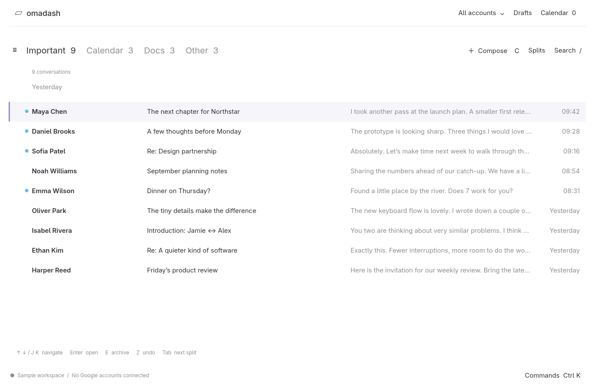
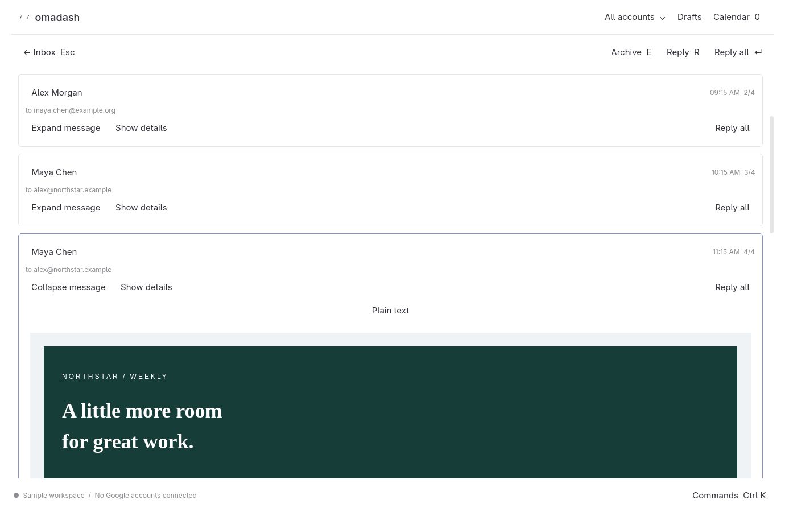
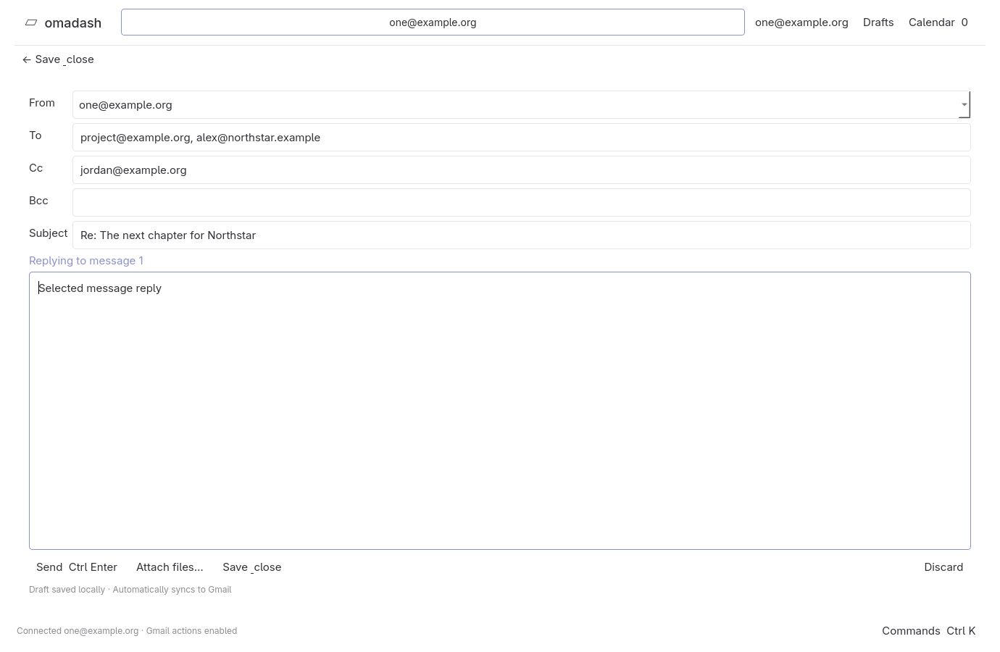

# Omadash — PRD v0.1

Date: September 13, 2026
Status: Initial product definition following interactive discovery
Product name: Omadash

## Interface screenshots

Actual native preview 06 screenshots using fictional sample messages and accounts. These illustrate the current implementation; the PRD defines the full release target. Appearance follows the active theme, with the light fallback shown here.

### Inbox

One row per conversation, split tabs, blue unread indicators, and keyboard selection.

### Email reader

Individual messages remain selectable within a conversation, with formatted HTML displayed in the main workspace.

### Compose and reply

Full-workspace composition with To/Cc/Bcc, selected-message reply context, and attachment controls.

## 1. Product intent

Omadash is a fast, keyboard-first email client for high-performing professionals in the Omarchy community: founders, executives, developers, and other technology professionals who want to accelerate inbox management and daily workflows.

The primary audience handles frequent email decisions, coordinates commitments across Google accounts, and values uninterrupted keyboard workflows. Their needs are to identify important conversations quickly, process mail with fewer actions, retrieve any past exchange, and coordinate calendars without unnecessary context switching.

The product promises focused presentation, rapid triage, useful inbox separation, and fast retrieval. Its audience is defined by workflow needs and use of Omarchy, rather than a particular individual's inbox.

The defining experience is a clean list of conversations, one line per thread. Users move a visible selection up and down, press Enter to read a thread, and return to the list without losing their place.

PRD v0.1 is the document version; “first release” below means the initial usable product. The product must be a native desktop application. C++ with Qt is the selected direction for the next technical prototype; the existing Electron preview is an interaction reference, not the production foundation. Release date and business model remain undecided. The native source repository retains the previous product's MIT license.

## 2. Confirmed decisions

| Topic | Agreed scope |
|---|---|
| Audience | High-performing Omarchy professionals, founders, executives, developers, and other technology professionals seeking faster inbox management and daily workflows |
| Application platform | Native desktop application; evaluate and prototype C++/Qt rather than continuing the Electron implementation |
| Interaction model | One main window; compose, search, thread reading, and calendar stay within it. Settings, split management, and account management may use overlays |
| Message-level actions | Navigate and select individual messages inside a thread; reply/forward targets the selected message |
| Highest priorities | Keyboard triage, split inboxes, fast search; speed is fundamental |
| External services | Gmail and Google Calendar only for the first release |
| Accounts | Multiple Google accounts in the first release |
| Main screen | Compact list; bold sender, subject, muted content snippet; one line per conversation |
| Keyboard compatibility | One-to-one default action/key/context mapping to reference R1; deferred actions retain reserved bindings |
| Opening mail | Up/down moves the highlighted selection; Enter opens the entire conversation |
| Splits | Editable defaults and custom splits in the first release |
| Split assignment | First matching split only, in tab order; Other catches unmatched conversations |
| Search coverage | All Gmail history across connected accounts |
| Compose | New message, reply/reply-all, forward, attachments, autosaved drafts, per-account signatures, undo send |
| Deferred | Snooze, follow-up reminders, snippets, scheduled sending |
| Collaboration | Excluded from the first few releases; may be considered later |

## 3. Core user journeys

1. Connect multiple Google accounts, choose the account view, and start processing mail.
2. Switch between split tabs, move through conversation rows, archive or otherwise triage using the keyboard, and undo mistakes.
3. Open a conversation with Enter, select any message using Up/Down, inspect its headers, reply to that message, and return to the same list position.
4. Find a conversation anywhere in Gmail history using text and filters, then navigate results using the same list interaction.
5. Compose with the correct account identity, attach files, save a draft, and send with an undo opportunity.
6. Consult Google Calendar while handling email and manage basic invitations and scheduling.

## 4. First-release functional requirements

The scope above is confirmed. Detailed behaviors below are proposed acceptance criteria unless explicitly captured as a confirmed decision; they make the PRD reviewable without treating every implementation detail as approved.

### F0. Native application and one-window interaction model

Confirmed after review of the first interaction preview:

- Build the application shell and core inbox, search, compose, and calendar controls natively. C++/Qt is the next prototype direction. An embedded HTML renderer, if needed, is confined to email content rather than implementing the entire application UI.
- Keep normal email work in one main window. Change the contents of the central workspace or reveal an attached panel; do not open compose, search, or calendar as modal overlays, pop-ups, detached windows, or separate browser pages.
- New-message composition occupies the main workspace. Replies are edited inline in the thread and clearly associated with the selected source message.
- Search uses an integrated query bar above the conversation list; results replace that list in place. Query input, account filters, search status, and results stay together.
- Calendar uses a docked right-hand panel that resizes the mail workspace without dimming or blocking it. If more room is needed, expand within the same main window and preserve the mail/draft state.
- Settings, split management, and account management may use overlays. Commands, contextual help, and header details should use integrated controls or inline expansion. Standard OS file pickers and external Google sign-in remain system interactions, not additional mail workspaces.
- Preserve draft content, text selection/caret, selected conversation/message, search query, split, account filter, and scroll position when changing workspace modes or opening the calendar.
- Escape leaves the active editor without discarding its draft, closes a contextual panel when it has focus, or returns to the prior mail context as appropriate. State transitions must be predictable and documented.
- Detached-compose and extra-window shortcuts in reference R1 remain reserved and disabled for the first release. Do not redirect them to unrelated commands. This explicit interaction constraint takes precedence over optional parity features.

Acceptance: Compose a new draft, consult the calendar, return to the draft, search for an older conversation, and resume the draft without losing text or spawning an application window or modal. Repeat in a narrow tiled window; adapt the layout within that same window.

### F1. Accounts and identity

- Connect, reconnect, and remove multiple Google accounts independently.
- Provide combined and per-account inbox views with a clear active account/filter.
- Keep account ownership visible without overwhelming the compact inbox design.
- Default replies to the receiving account; visibly identify the sender before sending.
- Keep conversations from different accounts distinct, including copies of the same exchange.
- One account's authentication failure must not disable the others.

Acceptance: With two accounts connected, the user can switch views, find a thread in either account, and reply from its owning account. Reconnecting one account preserves the other account's usability.

### F2. Compact inbox and reading view

- Render one single-line row per entire conversation: bold sender area, subject, muted content preview, and compact metadata where necessary.
- Truncate overflow rather than wrapping rows. The supplied screenshot is the visual reference for hierarchy and density, not a commitment to its exact colors or branding.
- Show split tabs above the list. Do not display a message preview pane in the main inbox.
- Keep selection clearly highlighted with a subtle tint and a thin leading accent bar, separate from unread status.
- Indicate unread conversations with a small blue circle before the sender. Sender and subject font weights remain consistent between read and unread conversations.
- Follow the supplied main-screen visual reference: clean sans-serif typography, single-line rows, muted snippets and times, date group headings, and account tabs above split navigation. Use the active Omarchy theme for background, text, and selection accents; refresh automatically when the theme changes.
- Up/down changes selection; Enter opens the selected thread in the main workspace.
- Proposed: Escape returns to the same split, scroll position, and selected thread.
- Proposed: selection alone does not mark a conversation read; a thread is unread when it contains unread messages.
- Proposed: show a message count; open at the first unread message, or the latest message if all are read.
- Render messages and attachments legibly, including long conversations and HTML email.
- Maintain an explicit selected message within the open thread, with a clear highlight or selection bar. Up/Down moves between messages when message navigation has focus; N/P retains its reference next/previous-message behavior. Keep text editing, text selection, and scrolling contexts separate.
- Enter starts reply-all for the selected message; R starts reply and F forwards that selected message. The source must not silently fall back to the last message. Preserve source message ID, subject, relevant recipients, quoting context, and reply headers.
- Derive reply recipients from the selected message’s Reply-To/From and To/Cc fields as appropriate, excluding the sending account’s own identities. Never add Bcc recipients to reply-all automatically.
- Expand message header details inline, accessible by mouse and a discoverable keyboard command. Show full sender name and address, Reply-To when present, To, Cc, available Bcc, full date/time with time zone, and the owning Google account.
- Provide inline access to the available original header block for advanced inspection. Values must be selectable/copyable. Missing header values are not inferred; distinguish unavailable Bcc from an assertion that no Bcc recipients existed.
- Preserve message selection when expanding headers and after leaving an inline reply. Opening a thread may initially select the first unread message or latest read message; subsequent actions use the actual current selection.

Acceptance: The user can navigate, open a multi-message thread, and return without losing their place. In a thread with five messages and differing senders/recipients, select the second message, expand its full headers, and invoke Enter/R/F; each action must use that second message, not the fifth. Missing Bcc must not be invented. New mail arriving during navigation must not unexpectedly change the selected conversation or message.

### F3. Keyboard triage

- Make navigation, opening, replying, archiving, deleting, marking read/unread, and applying labels available by keyboard.
- Provide a command palette and discoverable shortcuts. Default bindings must match reference R1 one-to-one for supported actions, including J/K navigation; see F9 and the mapping in section 10.
- Apply list-level triage to the conversation as a whole, with provider-specific message-state semantics verified during implementation.
- After a conversation leaves a list, move selection predictably to the next row, or the previous row at the end.
- Provide undo for reversible triage actions and expose failed synchronization clearly.
- Proposed: support selecting multiple conversations and applying bulk actions.
- Avoid firing list shortcuts while the user types in a composer or search field.

Acceptance: A user can process a representative inbox without using a mouse. A failed remote action does not silently leave the interface claiming success.

### F4. Split inboxes

- Start with editable Important, Calendar, Docs, and Other splits.
- Support creating, renaming, reordering, and deleting custom splits.
- Support rules based on senders, domains, Gmail labels, and search criteria.
- Evaluate in visible tab order; assign each eligible conversation to its first matching split only.
- Keep Other as the final catch-all. Reordering splits updates assignment.
- Distinguish split membership from Gmail labels; changing a split rule does not inherently relabel mail.
- Calendar and Docs splits classify email; Docs does not introduce a Google Drive integration.
- Proposed: show counts and allow keyboard switching between tabs.

Acceptance: A thread matching two splits appears only in the earlier one. Reversing their order moves it to the newly earlier split. An unmatched inbox thread appears in Other.

Open details: exact default rules, count meaning (unread versus total), rule AND/OR syntax, whether matching considers any message or the latest message, and whether split definitions are global or account-specific.

### F5. Full-history search

- Search all Gmail history for every connected account, including archived mail; do not impose a recent-mail-only product cutoff.
- Provide cross-account search and account filtering.
- Proposed filters: sender, recipient, subject, body, Gmail label, date, unread state, and attachment presence.
- Return conversation rows with the same selection and Enter-to-open behavior as the inbox. The query bar and results occupy the main workspace, with no search overlay. Down moves from the query into results; Escape restores the prior inbox context.
- Full-history online search must be available without waiting for a complete local index; validate the provider-backed retrieval approach in a technical spike.
- Local indexing improves responsiveness in the background. Clearly distinguish loading, partial results, complete results, and errors.
- Offline search is limited to downloaded/indexed data and must state that limitation.
- Paginate broad result sets without silently dropping older matches.

Acceptance: A known conversation from years ago is discoverable while initial local indexing is incomplete. Account filters exclude other accounts. Partial results never imply there are no more matches.

Open details: spam/trash inclusion, attachment-content indexing, supported search syntax, and cross-account result ordering. “All history” confirms time coverage; it does not yet settle those details.

### F6. Compose and send

- Support new messages, reply, reply-all, and forwarding in the main workspace. New drafts use a focused main-area composer; replies appear inline at the selected message, with the reply target visible.
- Support recipients, CC/BCC, subject, message body, file attachments, and per-account signatures.
- Autosave drafts and recover them after restart; surface save failures.
- Clearly display the selected sending account and allow account selection for new messages.
- Provide an undo-send opportunity with a visible, defined cancellation window.
- Keep delivery failures and uncertain send outcomes visible; avoid duplicate sends during retries.
- Proposed: recipient autocomplete based on available email history. A separate Google Contacts integration is not included in the confirmed service scope.

Acceptance: Compose a reply with an attachment, restart before sending, recover the draft, and send from the correct account. Undo within the cancellation window prevents submission. Failed delivery retains recoverable content.

Open details: editor formatting, sender aliases, draft synchronization behavior, undo duration, and offline-send behavior.

### F7. Google Calendar

Google Calendar and multiple accounts are confirmed for the first release. The following feature breakdown remains the proposed baseline discussed during discovery:

- Combined agenda with account/calendar filters.
- View upcoming events and inspect availability while composing in an optional docked right-hand calendar panel. Opening it resizes the workspace and preserves the draft; do not use a calendar modal or separate window. Event details and editing stay within the same workspace/panel.
- Accept, decline, or tentatively accept invitations.
- Insert available time slots into email using selected calendars across accounts.
- Create an event from email with review of attendees, calendar, time, and details before sending invitations.
- Select visible calendars and a default calendar for creation.
- Clearly display time zones and open existing meeting links.
- Use private events to block availability without disclosing their titles or details.

Acceptance: An event on a selected personal calendar blocks that time when proposing work availability. Event creation uses the chosen calendar and reviewed invitees. Time-zone presentation is unambiguous.

Proposed deferrals: full calendar editing, recurring-event management, and booking pages. Confirm the precise Calendar boundary before implementation.

### F8. Omarchy fit

- Deliver an installable application suitable for everyday use on Omarchy.
- Proposed integration: launcher entry, mailto handling, desktop notifications that open the relevant conversation, theme alignment, and default-app handling for links and attachments.
- Preserve keyboard usability and compact layout in tiled and resized windows.
- Define installation, upgrades, account disconnect, and local-data removal behavior.

Acceptance: On the agreed reference Omarchy setup, the application launches reliably, remains usable when tiled, and supports its core keyboard workflow without collisions with essential desktop bindings.

### F9. Default keyboard compatibility

- Reference R1, the supplied Mac edition v8, is the binding authority. The confirmed Linux modifier translation is Command (⌘) → Ctrl and source Control → Alt. Preserve the exact source bindings alongside the translated target bindings for traceability. The section 10 mapping accounts for every action in its two unique pages; the remaining two pages repeat them.
- Preserve each action’s base key, sequence, and interaction context one-to-one, subject only to the explicitly selected Linux modifier translation. A plain letter is unmodified unless Shift is written; “then” denotes a sequence, and “+” denotes simultaneous keys. Symbols such as # and ! denote the produced character and must be tested on supported keyboard layouts.
- Supported first-release actions use these defaults. Actions outside the agreed scope remain reserved for their original purpose; shortcut compatibility does not bring deferred features into the first release.
- The mapping labels actions Required, Conditional, or Deferred. F0 overrides the optional detached-composition and additional-window features: their bindings remain reserved and inactive in the first release. Required applies to the confirmed core workflow and its keyboard controls. Conditional reserves the binding pending the associated feature decision. Deferred keeps explicitly postponed features inactive. These are product requirements, not claims of implemented functionality.
- Dispatch by context: Enter opens a selected list thread and invokes reply-all on the selected message in the reading view; in the editor it inserts a newline. Tab advances splits in the inbox, moves among links/dates in the reader, and indents within an editor list. Standard focus traversal remains available outside those specific contexts.
- Ctrl+K opens an integrated command bar outside the editor and inserts a hyperlink in the editor when formatting is enabled. Ctrl+Shift+A selects all conversations in the list and attaches files in the composer. Escape dismisses the active overlay/selection before navigating back; returning from the reader preserves list position.
- Do not fire single-letter mail actions while entering text. Clearly expose available bindings and active context in shortcut help.
- Up/Down message selection is an explicit enhancement to the reference map; N/P remains supported. Test default bindings on the reference Omarchy setup. Record compositor/runtime conflicts for resolution with the product owner; do not silently substitute different defaults or modify desktop configuration. Optional user overrides may supplement the reference map.
- Source labels that do not fully specify behavior require verification before implementation, particularly immediate-send behavior and selection-range semantics. Keep those keys reserved until resolved.

Acceptance: Exercise every enabled mapping in list, reader, composer, search, and calendar contexts as applicable. Verify the same key does not invoke an action from an inactive context. Check sequential commands, text entry, overlays, and OS conflicts. Required actions must pass before release; Conditional and Deferred actions must not claim working support until implemented and validated.

## 5. Speed and quality requirements

Proposed budgets, not yet validated or approved:

| Interaction | Proposed p95 target |
|---|---|
| Visible keyboard selection feedback | At most 50 ms |
| Open a cached conversation | At most 100 ms |
| First local search results | At most 200 ms |

- Measure from user input to visible result on an agreed reference machine and representative dataset.
- Set account count, mailbox size, thread lengths, cache state, and test conditions before using these as release gates.
- Network-backed full-history search needs a separate measured target; the local-search target is not a promise of complete remote results within 200 ms.
- Synchronization and indexing must not block keyboard input.
- Define and test draft recovery, account isolation, retries, and visible synchronization failures.
- Proposed baseline: protect credentials using an appropriate desktop credential store, safely render untrusted HTML, and define remote-image loading and local-cache retention.
- Preserve visible focus and readable contrast across supported themes.

## 6. Success criteria and release validation

Release acceptance is validated exclusively with the product owner using their daily workflows, connected accounts, and reference Omarchy setup. No community cohort or other participant is required for this PRD's success criteria. The product owner is the sole acceptance authority, separate from the target audience definition.

- Complete the core read/triage/search/reply workflow using only the keyboard.
- Verify every enabled reference R1 binding produces its mapped action in the correct context; verify reserved bindings are not reassigned. Have the product owner validate the resulting workflow and any platform conflicts.
- Find known old conversations across connected accounts before full local indexing completes.
- Never lose draft content or hide failed sends in the tested recovery scenarios.
- Demonstrate correct first-match split assignment and account identity.
- Compare time and action count for the same representative triage/search tasks against the owner's current Gmail workflow; establish a baseline before setting a percentage improvement goal.
- Pass the agreed performance budgets on the declared reference setup.
- Validate the selected Calendar workflows across at least two Google accounts.
- Validate compose, search, calendar, selected-message replies, and inline header details in one native application window, with no unexpected overlays or loss of context.

## 7. Out of scope and later candidates

Confirmed deferred: snooze, follow-up reminders, snippets, scheduled sending, other email providers, and team collaboration for the first few releases.

Not committed: AI features, read receipts, CRM, task-manager/notes integrations, local automation API, dedicated meeting-service integrations, advanced unsubscribe/block tools, and enterprise administration. AI was discussed but never selected; external AI providers would require revisiting the Gmail/Calendar-only integration boundary.

## 8. Decisions to resolve before implementation

1. Confirm the detailed Calendar feature boundary.
2. Validate the C++/Qt native prototype, choose the native UI and bounded email-rendering components, define packaging, and determine whether any hosted backend is needed.
3. Validate Google authentication, permissions, distribution/verification requirements, and full-history search behavior against current official documentation.
4. Define default split predicates and remaining rule semantics.
5. Define indexing/storage policy, offline behavior, and multi-account search ordering.
6. Set performance reference hardware, mailbox dataset, and remote-search targets.
7. Resolve keyboard platform conflicts and any unverified source behavior without silently changing the agreed default mapping; define sender presentation for multi-person threads and read-state behavior.
8. Decide license and distribution model.

These are open decisions, not reasons to reopen confirmed product scope.

## 9. Suggested implementation sequence

1. Validate the native C++/Qt main window and the revised interaction model with representative data: compact inbox, main-area compose/search, docked calendar, message selection, and inline headers.
2. Validate account authorization, synchronization, full-history search, performance feasibility, and split assignment against this native foundation.
3. Complete multi-account Gmail reading, triage, compose, search, and recovery behavior.
4. Implement the confirmed Calendar subset and Omarchy desktop integration.
5. Run daily-driver validation and resolve release-blocking reliability and speed issues.

## 10. References and keyboard mapping

- Superhuman inbox screenshot supplied during discovery: visual reference for single-line rows, sender/subject/snippet hierarchy, tab navigation, and selection highlight. The Team tab in the screenshot does not imply collaboration scope.
- [Superhuman Mail feature matrix](https://superhuman.com/plans/mail), reviewed September 13, 2026: reference inventory spanning email productivity, search-adjacent workflows, scheduling, AI, and collaboration. It is not a blanket feature-parity commitment.
- [Superhuman Mail overview](https://superhuman.com/mail): product reference.
- [Omarchy](https://omarchy.org/): target desktop environment.

### R1. Keyboard binding authority

[Superhuman Mail Keyboard Shortcuts — supplied v8, Mac Edition](references/keyboard-shortcuts-reference.pdf), reviewed September 13, 2026. This user-selected attachment supersedes the previously consulted Windows & Linux edition. The mapping below was checked against the supplied PDF’s text and rendered layout. Each row preserves the source binding and maps it to the corresponding Omadash action, with the confirmed Linux modifier translation shown separately. Generic action names are used for Omadash; no product branding is carried into commands.

The PDF documents bindings, not complete runtime semantics. The Linux column is the confirmed default keymap: Command (⌘) → Ctrl and source Control → Alt, with all other keys and sequences preserved. Conditional entries preserve compatibility without adding unapproved feature scope. In particular, calendar week view, advanced formatting, windows/tabs, and pop-out composition require their associated scope decisions.

#### Commands and selection

| Omadash action | Exact supplied binding | Omadash Linux binding | Release status |
|---|---|---|---|
| Command palette | `⌘+K` | `Ctrl+K` | Required |
| Search | `/` | `/` | Required |
| Undo | `Z` | `Z` | Required |
| AI query | `?` | `?` | Conditional |
| Select conversation | `X` | `X` | Required |
| Extend selection | `Shift+J or Shift+K` | `Shift+J or Shift+K` | Required |
| Clear selection | `Esc` | `Esc` | Required |
| Select from current position | `⌘+A` | `Ctrl+A` | Required |
| Select all conversations | `⌘+Shift+A` | `Ctrl+Shift+A` | Required |

#### Conversation actions

| Omadash action | Exact supplied binding | Omadash Linux binding | Release status |
|---|---|---|---|
| Archive | `E` | `E` | Required |
| Return to inbox | `Shift+E` | `Shift+E` | Required |
| Snooze | `H` | `H` | Deferred |
| Toggle star | `S` | `S` | Conditional |
| Toggle read state | `U` | `U` | Required |
| Trash | `#` | `#` | Required |
| Report spam | `!` | `!` | Conditional |
| Mute | `Shift+M` | `Shift+M` | Conditional |
| Unsubscribe | `⌘+U` | `Ctrl+U` | Conditional |

#### Reading and starting messages

| Omadash action | Exact supplied binding | Omadash Linux binding | Release status |
|---|---|---|---|
| Compose | `C` | `C` | Required |
| Reply-all in reader | `Enter` | `Enter` | Required |
| Reply | `R` | `R` | Required |
| Forward | `F` | `F` | Required |
| Open links/attachments | `⌘+O` | `Ctrl+O` | Required |
| Cycle links/dates | `Tab` | `Tab` | Required |
| Expand message | `O` | `O` | Required |
| Expand all messages | `Shift+O` | `Shift+O` | Required |

#### Labels

| Omadash action | Exact supplied binding | Omadash Linux binding | Release status |
|---|---|---|---|
| Add/remove label | `L` | `L` | Required |
| Remove current label | `Y` | `Y` | Required |
| Remove label; next | `[` | `[` | Required |
| Remove label; previous | `]` | `]` | Required |
| Remove all labels | `Shift+Y` | `Shift+Y` | Required |
| Move | `V` | `V` | Required |

#### Filters

| Omadash action | Exact supplied binding | Omadash Linux binding | Release status |
|---|---|---|---|
| Unread filter | `Shift+U` | `Shift+U` | Required |
| Starred filter | `Shift+S` | `Shift+S` | Conditional |
| Important filter | `Shift+I` | `Shift+I` | Required |
| Unanswered filter | `Shift+R` | `Shift+R` | Conditional |

#### Destinations

| Omadash action | Exact supplied binding | Omadash Linux binding | Release status |
|---|---|---|---|
| Inbox / Important | `G then I` | `G then I` | Required |
| Other | `G then O` | `G then O` | Required |
| Starred | `G then S` | `G then S` | Conditional |
| Drafts | `G then D` | `G then D` | Required |
| Sent | `G then T` | `G then T` | Required |
| Archived / Done | `G then E` | `G then E` | Required |
| Reminders | `G then H` | `G then H` | Deferred |
| Muted | `G then M` | `G then M` | Conditional |
| Snippets | `G then ;` | `G then ;` | Deferred |
| Spam | `G then !` | `G then !` | Conditional |
| Trash | `G then #` | `G then #` | Required |
| All mail | `G then A` | `G then A` | Required |
| Label view | `G then L` | `G then L` | Required |

#### Calendar context

| Omadash action | Exact supplied binding | Omadash Linux binding | Release status |
|---|---|---|---|
| Day view | `0` | `0` | Conditional |
| Week view | `0 then 0` | `0 then 0` | Conditional |
| Today | `T` | `T` | Conditional |
| Previous day/week | `P or -` | `P or -` | Conditional |
| Next day/week | `N or =` | `N or =` | Conditional |
| Create event | `B` | `B` | Conditional |

#### Editor formatting

| Omadash action | Exact supplied binding | Omadash Linux binding | Release status |
|---|---|---|---|
| Bold | `⌘+B` | `Ctrl+B` | Conditional |
| Italic | `⌘+I` | `Ctrl+I` | Conditional |
| Underline | `⌘+U` | `Ctrl+U` | Conditional |
| Link | `⌘+K` | `Ctrl+K` | Conditional |
| Text color | `⌘+O` | `Ctrl+O` | Conditional |
| Strikethrough | `⌘+Shift+X` | `Ctrl+Shift+X` | Conditional |
| Numbered list | `⌘+Shift+7` | `Ctrl+Shift+7` | Conditional |
| Bulleted list | `⌘+Shift+8` | `Ctrl+Shift+8` | Conditional |
| Quotation | `⌘+Shift+9` | `Ctrl+Shift+9` | Conditional |
| Indent list | `Tab` | `Tab` | Conditional |
| Outdent list | `Shift+Tab` | `Shift+Tab` | Conditional |
| Increase indent | `⌘+]` | `Ctrl+]` | Conditional |
| Decrease indent | `⌘+[` | `Ctrl+[` | Conditional |

#### Composer context

| Omadash action | Exact supplied binding | Omadash Linux binding | Release status |
|---|---|---|---|
| Focus To | `⌘+Shift+O` | `Ctrl+Shift+O` | Required |
| Focus Cc | `⌘+Shift+C` | `Ctrl+Shift+C` | Required |
| Focus Bcc | `⌘+Shift+B` | `Ctrl+Shift+B` | Required |
| Focus sender | `⌘+Shift+F` | `Ctrl+Shift+F` | Required |
| Focus subject | `⌘+Shift+S` | `Ctrl+Shift+S` | Required |
| Focus body | `⌘+Shift+M` | `Ctrl+Shift+M` | Required |
| Attach file | `⌘+Shift+A` | `Ctrl+Shift+A` | Required |
| Discard draft | `⌘+Shift+,` | `Ctrl+Shift+,` | Required |
| Move recipients to Bcc | `⌘+Shift+I` | `Ctrl+Shift+I` | Conditional |
| Set reminder | `⌘+Shift+H` | `Ctrl+Shift+H` | Deferred |
| Schedule send | `⌘+Shift+L` | `Ctrl+Shift+L` | Deferred |
| Inline snippet | `;` | `;` | Deferred |
| Snippet picker | `⌘+;` | `Ctrl+;` | Deferred |
| Emoji insertion | `:smile (typed trigger)` | `:smile (typed trigger)` | Conditional |
| Send | `⌘+Enter` | `Ctrl+Enter` | Required |
| Send and archive | `⌘+Shift+Enter` | `Ctrl+Shift+Enter` | Required |
| Immediate-send action | `⌘+Shift+Z` | `Ctrl+Shift+Z` | Conditional |

#### Navigation

| Omadash action | Exact supplied binding | Omadash Linux binding | Release status |
|---|---|---|---|
| Directional focus | `Right / Left / Up / Down` | `Right / Left / Up / Down` | Required |
| Next split | `Tab` | `Tab` | Required |
| Previous split | `Shift+Tab` | `Shift+Tab` | Required |
| Open thread from list | `Enter` | `Enter` | Required |
| Next/previous conversation | `J / K` | `J / K` | Required |
| Next/previous message | `N / P` | `N / P` | Required |
| Scroll down | `Space` | `Space` | Required |
| Scroll up | `Shift+Space` | `Shift+Space` | Required |
| Top/bottom | `⌘+Up / ⌘+Down` | `Ctrl+Up / Ctrl+Down` | Required |
| New window | `⌘+N` | `Ctrl+N` | Deferred |
| New app tab | `⌘+T` | `Ctrl+T` | Deferred |
| Next app tab | `⌘+Shift+]` | `Ctrl+Shift+]` | Deferred |
| Previous app tab | `⌘+Shift+[` | `Ctrl+Shift+[` | Deferred |
| Choose app tab | `⌘+1–9` | `Ctrl+1–9` | Deferred |
| Close app tab | `⌘+W` | `Ctrl+W` | Deferred |
| Choose account | `Ctrl+1–9` | `Alt+1–9` | Required |
| Increase font size | `⌘+=` | `Ctrl+=` | Conditional |
| Decrease font size | `⌘+-` | `Ctrl+-` | Conditional |
| Reset font size | `⌘+0` | `Ctrl+0` | Conditional |
| Copy current-view link | `Ctrl+/` | `Alt+/` | Conditional |
| Back | `Esc` | `Esc` | Required |

#### Detached composition

| Omadash action | Exact supplied binding | Omadash Linux binding | Release status |
|---|---|---|---|
| Toggle detached draft | `⌘+Shift+P` | `Ctrl+Shift+P` | Deferred |
| Detached reply | `Shift+R` | `Shift+R` | Deferred |
| Detached reply-all | `Shift+Enter` | `Shift+Enter` | Deferred |
| Detached new message | `Shift+C` | `Shift+C` | Deferred |
| Detached forward | `Shift+F` | `Shift+F` | Deferred |
| Detach draft and search | `⌘+/` | `Ctrl+/` | Deferred |
| Switch draft focus | `⌘+D` | `Ctrl+D` | Conditional |

The account shortcuts address positions 1–9 as in R1; accounts beyond those positions remain accessible through the account selector. Application tabs and split-inbox tabs are different contexts and must not share the wrong navigation handler.

### R2. Interaction research for the native revision

Official desktop references reviewed September 13, 2026:

- [Superhuman — Pop Out Compose](https://new.superhuman.com/pop-out-compose-98229): describes full-screen drafts as the focused default and detached composition as an optional workflow. Omadash adopts main-workspace composition and defers detached composition.
- [Superhuman — Search](https://help.superhuman.com/hc/en-us/articles/46005672652301-Search): documents desktop query entry, results across inbox/folders, and search-operator assistance in the sidebar. The no-overlay requirement is an explicit Omadash design decision.
- [Superhuman — Calendar Overview](https://help.superhuman.com/hc/en-us/articles/46005615985293-Calendar-Overview): documents a right-hand day sidebar and date context when inspecting invitations. Omadash keeps calendar work in the existing application window.
- [Superhuman — Attachments](https://help.superhuman.com/hc/en-us/articles/46005568142989-Attachments): documents selecting a particular message with N/P, a selection marker, R for reply, and Enter for reply-all. Omadash adds Up/Down navigation and requires inline header inspection.
- [RFC 5322, section 3.6.3](https://www.rfc-editor.org/rfc/rfc5322.html#section-3.6.3): describes recipient headers and why Bcc may be absent from a delivered message. Omadash displays only available Bcc information.

Reference precedence: the supplied v8 Mac keyboard PDF (R1), with the confirmed Linux modifier translation, remains authoritative for key bindings. Current online articles use some different keys, including week view and attachments. Do not silently replace R1 bindings with newer online defaults. F0’s no-detached-window decision and the explicitly added Up/Down message selection supersede optional reference behaviors.

Research boundary: full-screen composition, calendar sidebar placement, and selected-message replies are supported by the official sources. Exact current header-disclosure styling was not verified; the inline header design is an explicit Omadash requirement. Product behaviors in unverified screenshots or older articles must not be presented as confirmed current behavior.

### Account image preference (preview refinement)
- Each connected Google account has an “Automatically load external images” on/off setting in Accounts, off by default and remembered across app restarts.
- The setting applies to all messages for that account, including the currently open reader. Remove per-message loading controls.
- Explain in the setting tooltip that external images contact sender servers and may reveal message opens. Embedded MIME images are handled separately.

### Daily-use implementation — preview 06
- Remember connected accounts through the Linux Secret Service keyring; preserve mail and drafts in a private local cache. Never write OAuth refresh tokens to the mail database.
- Sync archive, trash, star, and read/unread actions with Gmail. Restore message-level label state for undo without overwriting unrelated labels.
- Support real composing and selected-message replies, To/Cc/Bcc, outgoing attachments, persistent local drafts, and Gmail draft synchronization. Sending requires an explicit Send or Ctrl+Enter action.
- Preserve drafts and prevent automatic retransmission when Gmail does not confirm a request, including across restart.
- Show cached mail promptly, index historical mail in the background, fetch conversations concurrently with a bound of four per job, and poll account history independently. Search all Gmail history through the server while local indexing progresses.
- Product acceptance remains with the product owner. Fixtures verify behavior; live-account restoration, consent, and real sending require owner validation.
